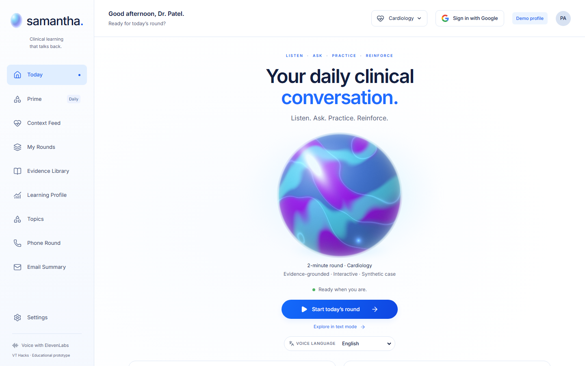

# Samantha

**Server-Authoritative Medical Assistant for Navigation, Training, Habit-building, and Assessment.**

A voice assistant that calls clinicians. Samantha phones a physician with their shift briefing, answers questions about it, and can pass a message to the front desk, hands-free, while they drive between hospitals. She answers when you call her too.

Built at VT Hacks 2026. Formerly named Cortana.

> Educational prototype. Every patient, unit and briefing is synthetic. No clinical validation, accredited credit, HIPAA compliance or patient-outcome claim.



## The call

Samantha rings and opens with the one thing worth knowing:

> "Hi, it's Samantha with your morning briefing. Dr. Zaybish, one thing I'd flag on the step-down unit before you get in. Is now a good time?"

From there it is a conversation, not a menu:

- **She leads with what changed.** Which patient, what moved, who asked for review and how soon. About twenty seconds, then she asks what you want next instead of reading the whole chart.
- **She answers from the briefing only.** Ask something it doesn't contain and she says so. Ask what you should do and she declines to advise, then repeats what the briefing records.
- **You can interrupt her.** She acknowledges it, answers, then offers back the thread you cut off.
- **You can pause her.** Say "hold on" and she stays quiet until you say resume.
- **She can message the front desk.** "Tell them I'm running twenty minutes late." She reads it back, waits for a yes, and sends it. The address lives on the server, so she can't be talked into mailing anyone else.
- **Call her back.** The number answers anyone who dials it with the same briefing, without touching a learner's saved record.

While one person holds the phone, everyone else can watch the call page: it streams the transcript as it happens, with a line whenever Samantha acts.

## Also in the app

- **Evidence round.** A two-minute voice lesson on one real trial (DAPA-HF, NEJM 2019, and its JAMA diabetes subgroup), then a synthetic case to apply it to.
- **Context Feed.** Load a shift scenario, from 15 bundled or your own JSON, and get briefed on it by voice or phone.
- **Prime.** Three questions a day with spaced review.
- **Email briefing.** Optional: a read-only Gmail connection summarised each morning.

## The rule behind the architecture

**The model speaks. It never decides.**

Grades, rewards, review dates and anything written to a profile are computed on this server from stored state. The agents call tools and read back the results. Content given to the model is labelled as data that can't change its behaviour. Phone tool calls need a shared secret **and** a signed session naming one profile and one round.

- [Architecture](docs/architecture.md): layers, request flows, invariants
- [Source map](src/README.md): what lives where
- [Security model](docs/security.md): callers, trust boundaries, known gaps
- [Engineering decisions](docs/decisions.md): the choices a reviewer will ask about

## Running it

Node 22 or later.

```bash
npm ci
npm run setup:local        # generates local secrets into .env.local
npm run dev -- --port 3100
```

With no ElevenLabs credentials the round runs as a labelled text preview: no microphone, no network calls.

- Browser voice: [docs/elevenlabs-setup.md](docs/elevenlabs-setup.md)
- Phone calls: [docs/phone-setup.md](docs/phone-setup.md), covering the carrier, the agents, the variables, and every failure we hit with its fix
- All settings: [.env.example](.env.example)

## Checks

```bash
npm run typecheck && npm run lint && npm run format:check
npm test            # Vitest: domain, routes, storage, voice controller
npm run test:e2e    # Playwright, against a dev server on 3100
npm run test:a11y   # axe WCAG 2.1 AA scan of every view
npm run check:secrets  # after a build: no server secret in the client bundle
```

CI runs typecheck, lint, format, unit tests and a build on pushes to `main` and on pull requests.

## Repository

```
src/            the app (see src/README.md)
voice-agents/   prompts and tool definitions for the three ElevenLabs agents
scripts/        agent configuration, setup and verification tooling
docs/           architecture, security, setup guides, feature notes
demo-data/      the bundled Context Feed scenarios
supabase/       the email briefing schema
tests/          Vitest suites, Playwright suites in tests/e2e
vendor/         the ElevenLabs UI orb, with its licence
```
