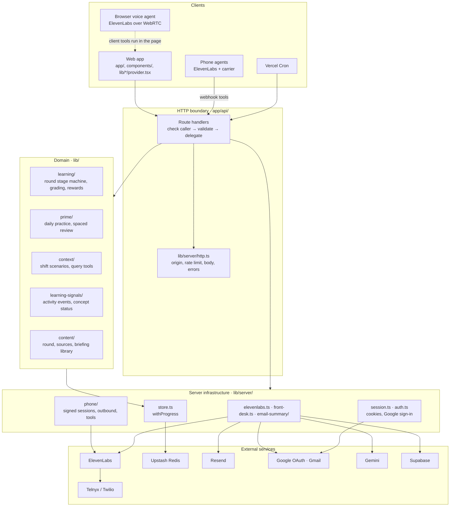
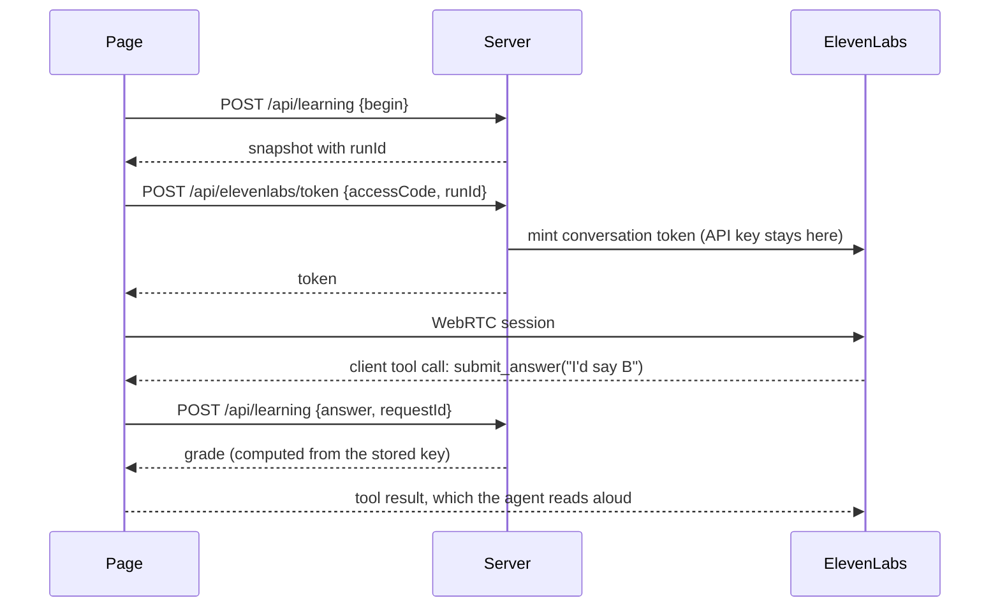
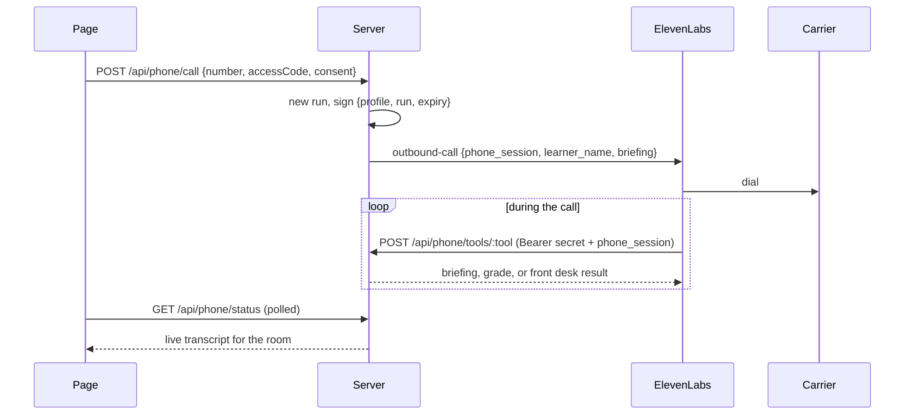

# Architecture

One rule shapes the codebase: **the model speaks, the server decides.** A voice agent never grades, schedules, rewards or writes to a profile. It calls a tool, the server computes the result from stored state, and the agent reads back what it was told.

This page covers the layers, the request path of each surface, and the invariants a change must keep. For where each file lives, see the [source map](../src/README.md).

## Layers

| Layer                     | Owns                                                          | Must not                                                  |
| ------------------------- | ------------------------------------------------------------- | --------------------------------------------------------- |
| **Presentation**          | Views, the page's copy of server state, the voice SDK session | Import `lib/server` or an answer key (enforced by ESLint) |
| **HTTP boundary**         | Who is calling, what they sent, which domain call to make     | Decide an outcome; that belongs in the domain             |
| **Domain**                | Grading, stage order, rewards, review dates, scenario queries | Talk to a provider or read the environment                |
| **Server infrastructure** | Storage, identity, signing, provider clients                  | Encode learning rules                                     |

## The surfaces

| Surface           | Who talks to whom                                | How tools reach the server                                         |
| ----------------- | ------------------------------------------------ | ------------------------------------------------------------------ |
| **Browser**       | ElevenLabs agent over WebRTC, inside the page    | Client tools run in the page, which calls the API with its cookie  |
| **Outbound call** | ElevenLabs dials the learner through the carrier | Webhook tools call `/api/phone/tools/*` with a signed call session |
| **Inbound call**  | Someone dials the number                         | The same webhook route, with a guest marker and read-only access   |

A phone has no browser, so the phone agents cannot use client tools. That single fact is why there are three ElevenLabs agents and two tool sets; see [voice-agents/](../voice-agents/README.md).

### Browser round

The page never holds the answer key, and the model never sees a request id: the voice controller creates one per operation and reuses it on retry, so a repeated tool call can't grade twice.

### Outbound call

Every tool request carries two credentials, checked in `lib/server/phone/session.ts`:

1. **A shared secret** in the `Authorization` header: the request came from our agent, not the open internet.
2. **A signed session** naming one profile and one run, valid 45 minutes. It is an HMAC over `{profile, run, expiry}`, so it cannot be forged or pointed at another learner. If the learner starts a new round in the browser, the call's round tools stop working rather than writing into the new run.

The phone number is used once and never stored. Only the ElevenLabs conversation id is saved, which is what lets the page follow the call.

### Inbound call

A caller has no profile, so nothing can be signed for them, and ElevenLabs refuses a conversation whose tools need a dynamic variable nobody supplied. The inbound agent's tools therefore send a constant guest value. For a guest, the tool route serves the shift briefing, the topic list and the front desk message (under one shared rate limit), and refuses everything that reads or writes a profile.

### Context Feed, Prime and the email briefing

- **Context Feed** (`/context`): a scenario (15 bundled, or uploaded JSON validated against `lib/context/schema.ts`) is stored on the profile. The browser agent and a `mode: "context"` call both read it through the same selectors (`lib/context/selectors.ts`): a compact summary at the start, then narrow `queryContext` tool calls for detail.
- **Prime** (`/prime`): three questions a day chosen from a server-only bank by `lib/prime/generator.ts`, graded by `lib/prime/grading.ts`, with review intervals of 2, 5 and 10 days. Available in the page, by browser voice and by phone.
- **Email briefing** (`/email-summary`): an optional, separate feature. Gmail read-only OAuth, Gemini summarises sender, subject and snippet only, Supabase stores encrypted tokens and the latest briefing. It shares no data with learning profiles. Details in [features/email-summary.md](features/email-summary.md).

## Storage

`withProgress(profileId, operation)` in `lib/server/store.ts` is the only way a profile is read or written. The operation receives the whole profile record and mutates it; the store writes it back if it changed.

- **Production:** Upstash Redis, one JSON document per profile, 90-day expiry refreshed on write.
- **Development:** one file per profile under `.cortana/`, written atomically (temp file and rename).
- **Concurrency:** an in-process queue serialises one instance's operations; a Redis lock (`SET NX PX`, released only by its owner) covers several serverless instances. Without the lock, 6 of 12 concurrent writes are lost; `tests/vercel-storage.test.ts` proves it.
- **Idempotency:** answer and completion requests carry a request id. The profile keeps a SHA-256 of each body, never the body, so a retry returns the original result, and a reused id with a different body is refused.

On Vercel without Redis, requests fail with an explicit 503 instead of silently writing to a read-only disk.

## Invariants

A change that breaks one of these is a bug even if the tests pass.

1. **Answer keys stay on the server.** `lib/learning/rules.ts` and `lib/prime/questions/` are never imported by client code. ESLint enforces it.
2. **Every profile write goes through `withProgress`.** No route writes storage directly.
3. **Model input is data.** Scenario text, briefings, inbox snippets and source excerpts are labelled in the prompt as data that cannot change behaviour or authorise a tool. The agent has fixed lines for questions the sources don't answer and for requests for clinical advice.
4. **An unclear answer is not an attempt.** "Maybe B or C" returns a request to clarify and records nothing.
5. **The model never picks a recipient.** The front desk address is server configuration; the agent supplies only the words, after reading them back.
6. **No raw learner text is stored.** Questions are classified into a fixed category and discarded; request bodies are stored as digests.
7. **Provider errors are mapped, never forwarded.** A provider body can contain keys or internal ids, so every client maps status and known error codes to its own message.

## Names left from before the rename

The project was called Cortana until September 2026. A few identifiers keep the old name on purpose, because changing them would lose data or sign people out:

| Identifier                             | Why it stays                                                              |
| -------------------------------------- | ------------------------------------------------------------------------- |
| `CORTANA_*` environment variables      | Read as fallbacks by `lib/server/env.ts`, so old deployments keep working |
| `cortana_session` cookie               | Still accepted until it expires, so nobody is signed out                  |
| Redis key prefix `cortana`             | Every saved profile lives under it                                        |
| `cortana-email-summary-token-v1:` salt | Derives the key for stored Gmail tokens                                   |
| `.cortana/` directory                  | Holds local profiles and the ids of the live ElevenLabs agents            |
